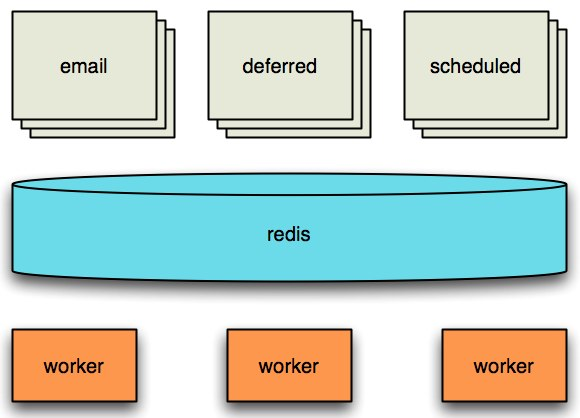
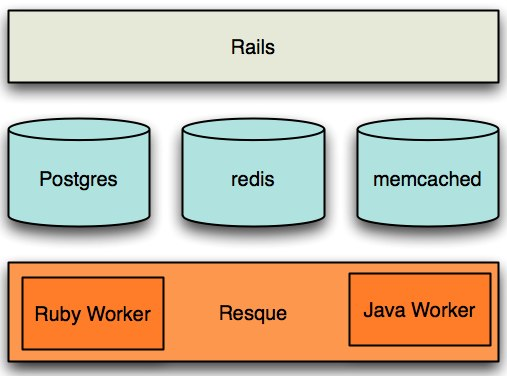
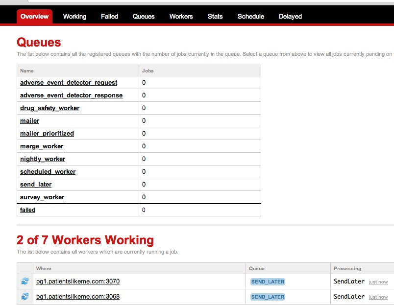

!SLIDE 

Resque
======

Kevin Hutson
------------

### Ruby and Java Software Engineer at HomeAway ###

### **Twitter/Github:** @mrjabba ###

**Blog:** <http://cedarpark.com>

!SLIDE fixed-top

My background.

!SLIDE fixed-top

This happened.

!SLIDE fixed-top

So, I made this happen.
Ruby as a hobby turned to work.

!SLIDE incremental

# Why Resque? #

* Redis Lists not SQL Tables
* Workers for stability
* Monitoring
* Ideal for Transient Data

!SLIDE fixed-top

Resque Overview

!SLIDE fixed-top

Resque w/ Rails

!SLIDE fixed-top

Resque w/ Rails

!SLIDE

# Resque at HomeAway #

* Transient Data
* Managing long running requests
* Data Warehouse extraction (WIP)

!SLIDE

# Transient Data #

* Metrics & A/B Testing 
* Redis is fast! No need to burden the app data that is transient.
* When testing completes, throw it away, or export it to another system.
	
!SLIDE

# Long Running Requests #

* On our site, we manage profiles between Travelers and Owners.

* Upload your photo/avatar.

* Use Resque to avoid espensive thumbnail operations (8 workers all on 1 server).

* Use AJAX to see if the job is done.

!SLIDE

# Data Warehouse extraction #

* Facebook data
* Millions of Friendship Connections
* DW wants aggregated counts of relationships

!SLIDE
# Queue-able AR Model #

	@@@ Ruby
	class Friendship < ActiveRecord::Base
	  @queue = :data_warehouse
	  after_create :add_to_queue

	  # your model code

	  def self.perform(friendship)
	  	#heavy lifting here
	  end

	  def add_to_queue
	    Resque.enqueue(Friendship, self.id)
	  end
	end

!SLIDE
# Queue up existing data #
	@@@ Ruby
	  task :enqueue_data => :env do
	    Friendship.update_all
	    	(:notified => false)
	    Friendship.find_each
	    	(:batch_size => 2000) do |rec|
	      rec.add_to_queue
	    end
	  end

!SLIDE
# Dequeue from Redis #
	@@@ Ruby
    def dequeue_jobs
      jobs = []
      @limit.to_i.times do
        if job = Resque.reserve
        	(:data_warehouse)
          jobs << job 
        end
      end
      jobs.uniq
    end

!SLIDE
# Resque.rb - Act like a stack #
	@@@ Ruby
	Resque.push('archive', 
		:class => 'Archive', 
		:args => [ 35, 'tar' ])
	Resque.pop(queue)

!SLIDE
# Resque.rb - Look inside #
	@@@ Ruby
	# To get the 3rd page of a 30 item, 
	# paginatied list one would use:
	Resque.peek('my_list', 59, 30)

!SLIDE

# What do we know? #

* Queues processed in alphabetical order (careful naming)

* Putting all data in Redis has been considered. Redis data can be backed up.

* Team consensus 
> <em>Experience with Mongo, Memcache, et al...For hash type data, feels Redis has been most reliable over time. </em>

!SLIDE

# Getting started #

<em>cd to your Rails app</em>

gem 'resque'

bundle install

% resque-web

..then..

!SLIDE fixed-top

Resque-Web 

!SLIDE

# But wait there's More! #
Resque plugins

* Job Scheduling
<https://github.com/bvandenbos/resque-scheduler>
* Retry, Delay, Exponential Backoff
<https://github.com/lantins/resque-retry>

!SLIDE

# Learn More about Redis #

##Redis Application Patterns in Rails##

* <em>Obie Fernandez - "A big hash in the sky"</em>
* <http://lanyrd.com/2012/railsconf/srhtx>
* <http://www.youtube.com/watch?v=dH6VYRMRQFw>

!SLIDE

# Thank you! #

**Borrowed from:** <https://github.com/wpeterson/resque-talk>

** Resque gem:** <https://github.com/defunkt/resque>

**Slides:** <http://resque-preso.herokuapp.com>

**Source:** <http://github.com/mrjabba/resque-preso>

### **Twitter/Github:** @mrjabba ###

